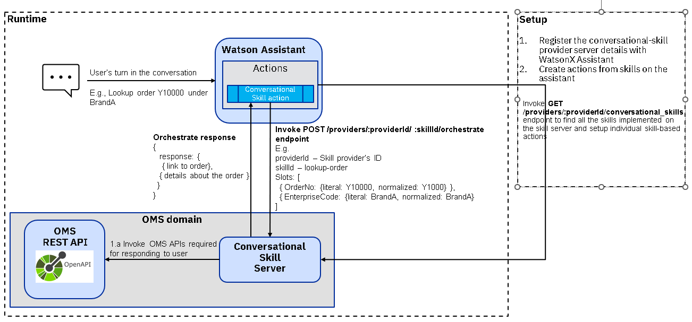

# Call-Center Conversational Skills

A conversational skill server implementation for IBM Sterling Order Management Call-Center. This server can be registered as as skills provider with IBM watsonx Orchestrate AI Assistant to create actions based on skills. To know more about conversational skills, please refer the following links:

- [Skill based actions](https://cloud.ibm.com/docs/watson-assistant?topic=watson-assistant-skill-based-actions)
- [Conversational skills](https://github.com/watson-developer-cloud/assistant-toolkit/tree/master/conversational-skills)
- [Conversational skill provider API reference](https://cloud.ibm.com/apidocs/assistant-v2#createprovider)

## Overview

The above diagram provides an high level overview of conversational skill based actions in IBM watsonx Orchestrate. Conversational skill based actions are backed by a skill provider, a server that implements the [endpoints](https://github.com/watson-developer-cloud/assistant-toolkit/blob/master/conversational-skills/procode-endpoints.md) prescribed by IBM watsonx Orchestrate. The assistant's turn in the conversation for a specific skill based action is controlled by the skill server. The skill provider service must be accessible from the assistant.

There are two phases to the conversational skill based actions, a setup phase and a runtime phase:

### Setup

Setting up conversational skill based actions involves two steps: registering the skill provider and configuring actions based on the skills implemented by the skill provider

#### Registration
Each Watson Assistant instance can have one skill provider registered against it. The registration is done manually by invoking [skill provider API](https://github.com/watson-developer-cloud/assistant-toolkit/blob/master/conversational-skills/README.md#Register-a-Conversational-Skill-Provider)

#### Creating actions based on the skills
Once a skill provider is registered, a new `Skill backed action` type appears on the assistant when creating a new action. When this option is chosen, the assistant invokes the `GET /providers/:providerId/conversational_skills` endpoint on the skill provider to list the skills provided by the server. An action is created against a skill by specifying a list of phrases that users can say when they intend to use this action.

### Runtime

During a conversation, the assistant will detect the user's intent to use a specific skill configured on it. At this time, the assistant invokes the `POST /providers/:providerId/ :skillId/orchestrate` with the specific skill Id (a unique identifier that represents a skill under a provider) along with the information relevant to the skill that it has gathered so far. The information gathered by the assistant is referred to as **slots**. When a skill is first identified, the assistant invokes the skill service asking for the slots to fill for the skill. Based on the slots in the response, the assistant will try to gather the information from the conversation history (or user prompt) and then proceed to ask user questions to fill those which are not filled. The assistant notifies the skill server about changes to slot's state allowing the server to react to slot changes and direct the conversation accordingly till the skill is complete or cancelled.

## Skills implemented
This implementation provides the following conversational skills:
- Get details about an order based on the order number

## Developing

The server uses [NestJS](http://nestjs.com).

### Prerequisites

- Node 18-LTS
- Install [yarn](https://classic.yarnpkg.com/en/docs/install)

### Installation

1. Run `yarn` to install the node modules required.
2. Create the `.env` file from the `env.template` file provided in the repo. The values needed to setup the environment are as follows:  
  **Required**:
    - **ASST_URL** - The AI Assistant instance URL.
    - **API_KEY** - The AI Assistant instance API key.
    - **SKILL_SERVER_DOMAIN** - The skill server domain. This will be used to register the skill server with AI Assistant.
    - **SKILL_SERVER_PORT** - The port on which the skill server is running.
    - **SKILL_PROVIDER_ID** - The unique ID of the skill provider.
    - **SERVER_AUTH_TOKEN** - The token/secret that is used to authenticate the incoming request from AI Assistant. This value is used when registering the skill provider and later used when the app is started.  
    - **OMS_API_ENDPOINT** - Set the OMS API endpoint to point to your OMS instance.  
  **Optional:**
    - ***HTTPS_CERT_PATH** - The file path of the certificate to use for the skill server.
    - **HTTPS_KEY_PATH** - The file path of the key file
    - **SERVER_HOSTNAME** - This is used to bind the application to a specific network interface.

### Running the skill server

The skill server should be accessible from your deployment of IBM watsonx Orchestrate. For instance, if you are using IBM watsonx Orchestrate on IBM Cloud, the skill server host must be reachable from IBM Cloud.

#### Registering the skill provider with WatsonX assistant (One time)

Run `node util/conv-skill-provider.js register` to register the skill provider with your instance of AI Assistant.

**Note:**  
- If you are updating the skill-provider registration, run `node util/conv-skill-provider.js update`.  
- To list the skill provider registration, run `node util/conv-skill-provider.js list` to verify the assistant instance is pointing to the correct skill provider server.

#### Running the skill server

**Development mode** `yarn start:dev`

**Production mode** `yarn start:prod`
